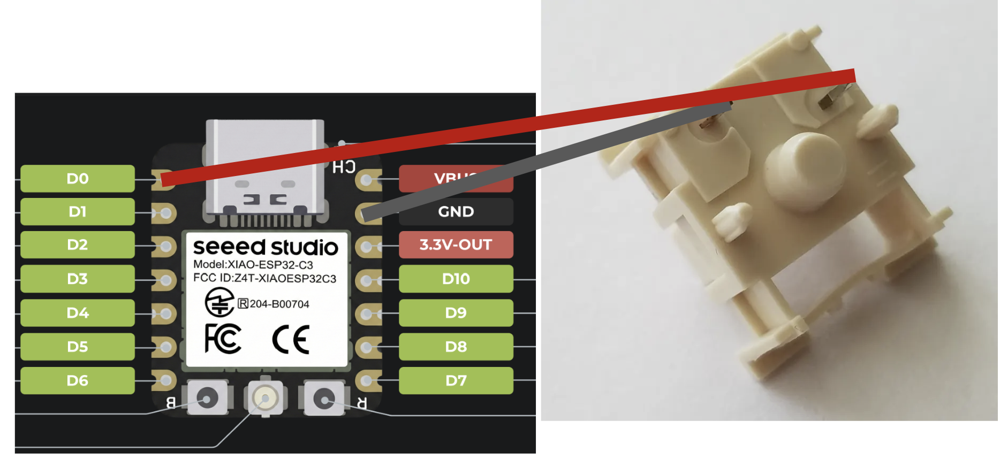

# ALARMING!

A small vibrating alarm that only turns off when you get up and hunt down another ESP32 button. For extra fun, you can ask your friends to hide it for you :) 

**Find the button to turn it off!**

## About
I am mildly bad at waking up in the mornings, and I think part of it is that I can just hit snooze on my alarm in bed. This is a way of circumventing that without making enough sound to annoy everyone living with me. Fun for if you have roommates!

## Assembly Instructions
### MAIN
Solder down the:
- 4x Seven-segment displays.
    - Solder one by one. Place into the throughhole slots on the top half of the PCB, making sure the decimal dot is in the bottom right corner. 
    
- 1x Seeed Xiao ESP32-C3
    - SOLDER BEFORE THE OLED DISPLAY. Place header pins with the short side for the Seeed, solder the Xiao to the header pins, then solder the Xiao to the PCB. Cut off excess on the pins. 
    
- 1x Vibrating Motor
    - SOLDER BEFORE THE OLED DISPLAY.
    - Align the two sides of the + - terminals, then solder exposed ends of the wire. 
    
- 2x Boot/EN buttons
    - SOLDER BEFORE THE OLED DISPLAY. 
    - SOLDER BEFORE LED. 
    - Align the button with the correct pads (make sure orientation is correct and the component is within the silkscreen). 
    
- 1x LED
    - SOLDER BEFORE THE OLED DISPLAY.
    - Align the direction of the LED as indicated on the silkscreen, then solder throughhole pins.
    
- 1x OLED display.
    - SOLDER AFTER ALL PARTS ABOVE. Place a header pin between the OLED display module and the PCB, with the shorter pins facing upwards, then align the display with the silkscreen outline and solder throughhole pins.
    
        
- 1x Rotary Encoder EC11
    - Place though mounting holes, then solder throughhole pins. 
    

3D-printed Case: 
- Print out the case! Take out any support struts if you have any. Insert heatsinks (4x M2 5mm for top, 4x M2 10mm for bottom half) Place the top half, making sure the port cutout is where the USB-C port is, then place the bottom half, aligning the port in the same way. Screw down the housing (4x M2 14mm Screws).

### Button
Use a keyboard switch, then solder one pin to GND on a Seeed Xiao ESP32, and another to D0. 

Make a case at your discretion!

## Firmware
Firmware written in Arduino IDE. Flash by copying code into Arduino IDE, then flashing the corresponding Seeed Xiao ESP32-C3 MCUs (main and button respectively).

## PCB 
### 3D Models

### Schematic

### PCB Layout

## CAD

## BOM
- 1x PCB (back side PCBA)
- 2x Seeed Xiao ESP32-C3
- 4x Seven-segment Display 
- 1x Rotary Encoder EC11
- 2x 4x4mm Push Switch
- 1x 3mm LED
- 1x OLED Display
- 1x Vibrating Motor

## BOM (Expanded)
- 1x PCB (back side PCBA, all files provided in )
    - $41.32 - [JLCPCB](jlcpcb.com) 
- 2x Seeed Xiao ESP32-C3
    - $9.21 - [Amazon](https://www.amazon.com/Seeed-Studio-XIAO-ESP32-ESP32C5/dp/B0B94JZ2YF?sr=8-7)
- 4x Seven-segment Display 
    - $0.87 - [LCSC](https://www.lcsc.com/product-detail/C8093.html?s_z=n_q_p_XDK-5161&spm=wm.ssy.bg.1.xh&lcsc_vid=RABbBlVeFVhZUgACR1hWUFJVFARYBlMCRFdeAwZVQlkxVlNeRFlbUVdfTlhdUDsOAxUeFF5JWBYZEEoKFBINSQcJGk4MFQUIE0wKAhAHHg1BVV1QWQkaCgg%3D)
- 1x Rotary Encoder EC11
    - $2.12 - [LCSC](https://www.lcsc.com/product-detail/C361167.html?s_z=n_q_t_EC11&spm=wm.fly.bg.2.xh___wm.ssy.tc.2.tz&lcsc_vid=QlRWUwBRRlFXAwBeFQAIBVNRRVULAwEEQAVaAVIAQQQxVlNeT1JfUlBXR1hWVDsOAxUeFF5JWBYZEEoKFBINSQcJGk4%3D)
- 2x 4x4mm Push Switch
    - $4.77 - [Aliexpress](https://www.aliexpress.us/item/3256812363662693.html?spm=a2g0o.productlist.main.2.9f2afc6hfc6hgc&algo_pvid=ce5fb20e-1501-429b-bf35-2a32c0622efe&algo_exp_id=ce5fb20e-1501-429b-bf35-2a32c0622efe-1&pdp_ext_f=%7B%22order%22%3A%2215%22%2C%22eval%22%3A%221%22%2C%22fromPage%22%3A%22search%22%7D&pdp_npi=6%40dis%21USD%214.37%210.99%21%21%2129.36%216.66%21%402101e81117861057478814823e0e95%2112000058673759179%21sea%21US%210%21ABX%211%210%21n_tag%3A-29910%3Bd%3Abf24fdfb%3Bm03_new_user%3A-29895%3BpisId%3A5000000210792324&curPageLogUid=IB3bPPIi35gd&utparam-url=scene%3Asearch%7Cquery_from%3A%7Cx_object_id%3A1005012549977445%7C_p_origin_prod%3A)
- 1x 3mm LED
    - $6.99 - [Amazon](https://www.amazon.com/CHANZON-Assortment-Colors-Clear-Transparent/dp/B01AUI4W5U?sr=8-3)
- 1x OLED Display
    - $6.88 - [Amazon](https://www.amazon.com/Screen-128x32-Display-SSD1306-Arduino/dp/B0DZGLN4FK?sr=8-4)
- 1x Vibrating Motor
    - $5.99 [Amazon](https://www.amazon.com/DIANN-Vibration-Button-Type-Vibrating-Appliances/dp/B0B4SMZCPW/ref=sr_1_2?sr=8-2)